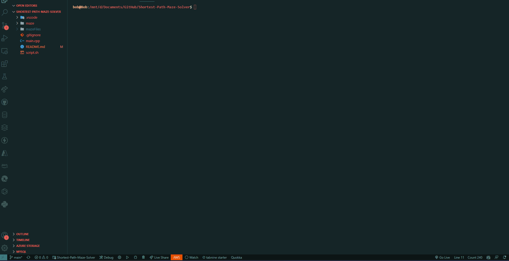

# Shortest Path Maze Solver

This program uses C++, it reads maze files and then solves it using DFS. The result shows a visual maze with the shortest path.

## Instructions For linux

1. Open terminal
2. Run program by typing: sh script.sh

## Demo

Figure 1: Maze Solver Demo
